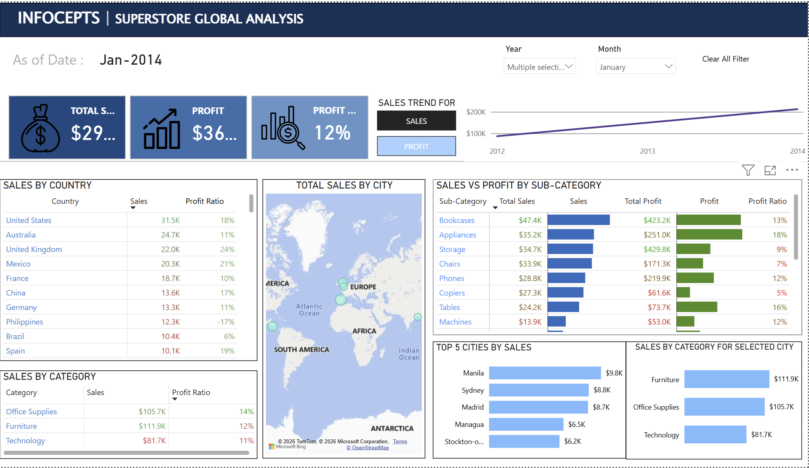

Global SuperStore Sales Performance Analysis

Project Overview
-This project presents an interactive Power BI dashboard developed to analyze the sales performance of a global retail superstore. The dashboard enables users to monitor sales, profitability, regional performance, and product category trends through dynamic visualizations, KPI cards, and interactive filters.

Business Objective
-To provide business stakeholders with an interactive dashboard that helps identify sales trends, profitable product categories, top-performing cities, and overall business performance for better decision-making.

Tools & Technologies
- Power BI
- Power Query
- DAX
- Data Visualization
- Data Modeling

Key Performance Indicators (KPIs)
- Total Sales
- Total Profit
- Profit Ratio

Dashboard Features
- Sales by Category
- Sales vs Profit by Sub-Category
- Top 5 Cities by Sales
- Top 10 Cities by Sales (Map Visualization)
- Sales Trend Analysis
- Profit Trend Analysis
- Interactive Date Filter
- Dynamic KPI Cards

Interactive Features
- Interactive slicers for dynamic filtering
- Date-based analysis
- Responsive visualizations
- Interactive map visualization

Business Insights
- Identified the highest-performing product categories.
- Compared sales and profitability across different sub-categories.
- Highlighted the top-performing cities based on sales.
- Tracked sales and profit trends over time.
- Enabled interactive analysis using filters and slicers.

Files Included
- Global-SuperStore-Sales-Analysis.pbix
- Dashboard Screenshot

Skills Demonstrated
- Dashboard Design
- Business Intelligence
- DAX Measures
- Data Modeling
- KPI Development
- Interactive Reporting
- Data Visualization
- Business Analytics

 If you found this project interesting, feel free to explore the dashboard and provide your feedback.
